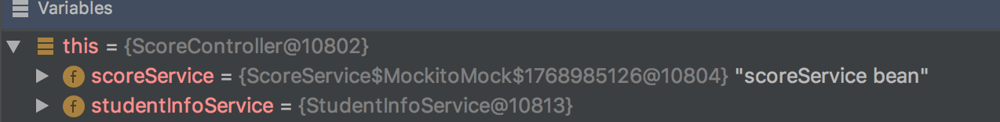
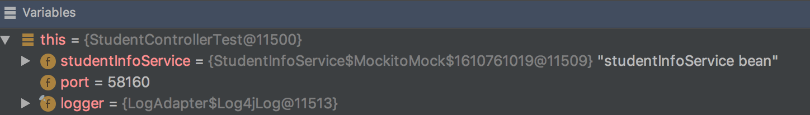
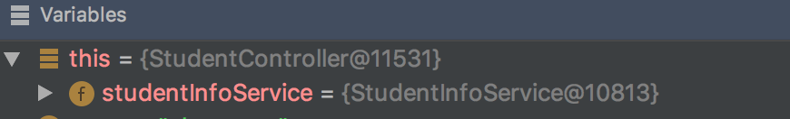
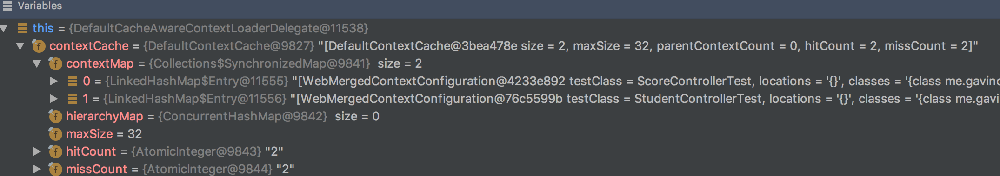

### 0. 小红的测试挂了

作为资深搬砖大师，小红的出手的各种代码，都会有对应的测试进行验证。但今天小红却犯了愁。
原来小红有两个测试，单独跑测试的时候都是草原绿，但一起跑的时候挂掉了。

### 1. 案发现场

小红在负责的学生管理系统里，有这么两个需求：

1. 根据名字搜索对应的学生
2. 点击搜索出来的学生信息，能查阅对应的成绩

小红针对这两个需求，提供了两个API分别用于上述场景：

* 根据名字搜索对应的学生列表
  
```java
@RestController
@RequestMapping("/students")
public class StudentController {

    private StudentInfoService studentInfoService;

    @Autowired
    public StudentController(StudentInfoService studentInfoService) {
        this.studentInfoService = studentInfoService;
    }

    @GetMapping
    public List<Student> getStudentByStudentNo(@RequestParam String name) {
        return studentInfoService.searchStudents(name);
    }

}
```

* 查阅成绩（通过学生标识查询即可）

```java

@RestController
@RequestMapping("/scores")
public class ScoreController {

    private ScoreService scoreService;

    @Autowired
    public ScoreController(StudentInfoService studentInfoService, ScoreService scoreService) {
        this.scoreService = scoreService;
    }

    @GetMapping
    public Score getScoreByStudentNo(@RequestParam String studentId) {
        return Score.builder().studentId(studentId).score(scoreService.getScore(studentId)).build();
    }
}
```

由于学生的基础信息和学生的成绩信息都是外部系统，因此在测试时，小红使用了Mock大法`@MockBean`（mockito）。具体如下：

* 学生搜索测试
  
```java
public class StudentControllerTest extends APITest {

    @Test
    public void should_search_students() {
        Student student = new Student("id", "studentNo", "zhangsan");
        when(studentInfoService.searchStudents(student.getName())).thenReturn(
                Lists.newArrayList(student));

        given().param("name", student.getName()).get("/students").then().statusCode(200).body(
                "[0].studentNo", is(student.getStudentNo())).body("[0].id", is(student.getId()));
    }
}
```

* 成绩查阅测试
  
```java
public class ScoreControllerTest extends APITest {

    @MockBean
    private ScoreService scoreService;

    @Test
    public void should_get_score_by_student_id() {
        Student student = new Student("id", "studentNo", "zhangsan");

        when(scoreService.getScore(student.getId())).thenReturn(99.9f);

        given().param("studentId", student.getId()).get("/scores").then().statusCode(200).body(
                "score", equalTo(99.9f));
    }
}
```

嗯？这里怎么有个`IntegrationTest`。这里小红抽象了个基础的API测试，主要处理一些RestAssured的配置。（RestAssured又是什么鬼--一个测试Rest API的框架）。具体如下：

```java
@SpringBootTest(webEnvironment = SpringBootTest.WebEnvironment.RANDOM_PORT)
@TestExecutionListeners({DirtiesContextTestExecutionListener.class,
        MockitoTestExecutionListener.class, DependencyInjectionTestExecutionListener.class})
@ActiveProfiles("test")
public abstract class APITest extends AbstractTestNGSpringContextTests {

    @LocalServerPort
    private int port;

    private static void initRestAssured(int port) {
        RestAssured.basePath = "/api";
        RestAssured.port = port;
        RestAssured.requestSpecification = new RequestSpecBuilder().setContentType(
                "application/json").build();
    }

    @BeforeMethod
    public void setUp() {
        initRestAssured(port);
    }

}
```


就这些了，小红单独跑`StudentControllerTest`和`ScoreControllerTest`都没有问题。可使用构建工具一起跑测试时，`StudentControllerTest`测试就会挂掉。并被丢过来一坨如下的错误信息：

```plain
java.lang.AssertionError: 1 expectation failed.
JSON path [0].studentNo doesn't match.
Expected: is "studentNo"
  Actual: null
```

真是百思不得其解，明明mock了`StudentInfoService`，怎么就像没有mock一样直接返回`null`了呢？难道mock失效了？还是选择性的失效吗？

### 2. 山重水复疑无路

mock没有生效，莫非是mock的对象和使用的对象是不同的实例，也就是说在`StudentControllerTest`中的mockBean studentInfoService和spring上下文中的studentInfoService不是同一个实例？

为了验证这点，小红在`ScoreController`也注入了`StudentInfoService`。然后调试发现，在运行`ScoreControllerTest`测试时，使用的对象为：



这也是符合预期的，因为这时并没有对`StudentInfoService`进行mock，当然就只有`ScoreService`被mock了。

在`StudentControllerTest`运行时，在测试方法处studentInfoService对象为：



而在执行到被测试的`StudentController`时，情况如下：



明眼人一下就看出来了，在`StudentControllerTest`执行时，测试里mock了`StudentInfoService`，但spring上下文里没有mock。再一细看，居然和`ScoreControllerTest`执行时，spring上下文中的`StudentInfoService`是一个实例。

难道多个测试共用的一个测试上下文吗？

经过一番排查，果不其然，由于启动spring上下文相对比较耗时，spring测试有缓存上下文的逻辑。在`DefaultCacheAwareContextLoaderDelegate`中，有如下代码片段：

```java
@Override
public ApplicationContext loadContext(MergedContextConfiguration mergedContextConfiguration) {
    synchronized (this.contextCache) {
        ApplicationContext context = this.contextCache.get(mergedContextConfiguration);
        if (context == null) {
            try {
                //load spring context
        }
        else {
            if (logger.isDebugEnabled()) {
                logger.debug(String.format("Retrieved ApplicationContext from cache with key [%s]",
                        mergedContextConfiguration));
            }
        }

        this.contextCache.logStatistics();

        return context;
    }
}
```

可以看到会先从缓存里获取，如果缓存没有再进行加载。另外，小红注意到，获取缓存的key为`MergedContextConfiguration`类型的对象。`MergedContextConfiguration`为spring上下文的配置，那么我们在上述两个测试里，他们的`mergedContextConfiguration`是一样的吗？

`contextCache`内部其实是一个`Map`。众所周知，map里的key是否是一致的，要看`hashcode`和`equals`两个方法：

```java
@Override
public boolean equals(@Nullable Object other) {
    if (this == other) {
        return true;
    }
    ...
    if (!this.contextCustomizers.equals(otherConfig.contextCustomizers)) {
        return false;
    }
    ...
    return true;
}

@Override
public int hashCode() {
    int result = Arrays.hashCode(this.locations);
    ...
    result = 31 * result + this.contextCustomizers.hashCode();
    ...
    return result;
}
```

这里为了节约篇幅，只列出这次需要关心的部分。小红看到要看`mergedContextConfiguration`是否一致，其中一个因素是看`contextCustomizers`是否一致。在使用了`@MockBean`的场景，会加载一个类型为`MockitoContextCustomizerFactory`的contextCustomizer。`MockitoContextCustomizerFactory`会解析使用`@MockBean`注入字段类型。

那么，也就是说针对上面的两个测试，因为他们的`@MockBean`使用的字段类型不一致，应该使用两个不同的spring上下文才对。事实也确实是这样的：



这就尴尬了，明明是两个不同的spring上下文，怎么运行时，两个测试用的是同一个上下文？

似乎无解了...

### 3. 柳暗花明又一村

小红注意到，在两个测试中，我们的`ApiTest`中的端口`port`是不一样的，也就是说这个属性的注入是跟着spring上下文走的。

既然现在的测试总是会走到同一个上下文里，那能不能直接测试第二个上下文的逻辑呢？

小红想到一个办法，在`StudentControllerTest`测试中的mock逻辑后，增加一个断点。当程序运行到这个断点后，拿到对应的端口`port`，然后在浏览器直接访问对应需要测试的api:`http://localhost:port/api/students`。

戏剧的一幕出现了，浏览器访问后返回了我们mock的student列表，不是空了。这就过分了。明明在`ApiTest`的`setup`中指定了需要访问的端口，怎么还是访问的最开始的端口，难道端口设置没生效？小红继续寻找真相。

依次跟踪了，RestAssured发起请求的流程，发现在`APITest`中我们设置了请求的content-type：

```java
 RestAssured.requestSpecification = new RequestSpecBuilder().setContentType(
                "application/json").build();
```

而RequestSpecBuilder的构造方法如下：

```java
    public RequestSpecBuilder() {
        this.spec = (RequestSpecificationImpl) new RequestSpecificationImpl(baseURI, port, basePath, authentication, filters(),
                requestSpecification, urlEncodingEnabled, config, new LogRepository(), proxy).config(RestAssured.config());
    }
```

其中第六个入参，为默认的请求描述（包含请求端口）。这个默认的请求描述来源于前一个测试设置的`RestAssured.requestSpecification`，也即`StudentControllerTest`运行时，则为`ScoreControllerTest`测试设置的请求描述。
就算默认值使用前一个也没关系，新设置了`RestAssured.port`，就应该用新的端口了。然而问题就出在这，我们看一下`RequestSpecificationImpl`的构造方法：

```java
public RequestSpecificationImpl(String baseURI, int requestPort, String basePath, AuthenticationScheme defaultAuthScheme, List<Filter> filters,
                                  RequestSpecification defaultSpec, boolean urlEncode, RestAssuredConfig restAssuredConfig, LogRepository logRepository,
                                  ProxySpecification proxySpecification) {
    ...
    port(requestPort)
    this.restAssuredConfig = restAssuredConfig
    if (defaultSpec != null) {
      spec(defaultSpec)
    }
    ...
  }
```
可以看到确实先设置了请求的端口，但后面接着处理默认的请求描述。继续看下是如何处理的：

```java
  RequestSpecification spec(RequestSpecification requestSpecificationToMerge) {
    SpecificationMerger.merge this, requestSpecificationToMerge
    return this
  }
```

好，继续跟进：

```java
def static void merge(RequestSpecificationImpl thisOne, RequestSpecificationImpl with) {
    notNull thisOne, "Specification to merge"
    notNull with, "Specification to merge with"

    thisOne.port = with.port
    thisOne.baseUri = with.baseUri
    thisOne.basePath = with.basePath
    thisOne.requestParameters.putAll(with.requestParameters)
    thisOne.queryParameters.putAll(with.queryParams)
    thisOne.formParameters.putAll(with.formParams)
    thisOne.namedPathParameters.putAll(with.pathParams)
    thisOne.multiParts.addAll(with.multiParts)
    thisOne.authenticationScheme = with.authenticationScheme
    mergeSessionId(thisOne, with)
    thisOne.cookies(with.cookies)
    thisOne.requestBody = with.requestBody
    mergeFilters(thisOne, with)
    thisOne.urlEncodingEnabled = with.urlEncodingEnabled
    thisOne.proxySpecification = with.proxySpecification
    thisOne.method = with.method
    thisOne.unnamedPathParamsTuples = with.unnamedPathParamValues
    thisOne.path = with.path

    mergeConfig(thisOne, with)
    // It's important that headers are merged after the configs are merged since HeaderConfig affects that way headers are merged.
    thisOne.headers(with.requestHeaders)
  }
```

注意，这里的第二个参数`with`就是我们的默认值。纳尼，居然用默认值覆盖了所有的值。你不是真正的默认值，你就是天你就是地，你才是最大啊！

**真相大白**了，虽然在`StudentControllerTest`测试时，我们设置了端口，但是由于RestAssured的原因，会继续使用前一个测试的端口设置。我们错怪了mock，罪魁祸首在发起请求的地方：RestAssured.

找到问题，解决办法就很简单了，在每次设置之前，将相关配置重置一下就可以了。如下：

```java
 private static void initRestAssured(int port) {
        RestAssured.reset();//用于重置restAssured相关配置
        RestAssured.basePath = "/api";
        RestAssured.port = port;
        RestAssured.requestSpecification = new RequestSpecBuilder().setContentType(
                "application/json").build();
    }
```

### 4. 若有所思

小红的测试终于可以继续愉快的运行了，但小红思虑重重。上面我们看到`@MockBean`会引起加载多次spring上下文。这个在项目越来越大的情况下，MockBean泛滥了之后，测试会如慢如蜗牛🐌。在API级别的测试，我们主要想把三方系统的依赖给mock掉，那么我们可以单独地将所有的三方依赖做成测试配置。然后所有的测试使用同一套测试配置，使用的地方直接使用`@Autowired`注入即可。

比如这里，我们会增加一个测试配置：

```java
@Configuration
public class TestConfiguration {

    @Bean
    public StudentInfoService mockStudentInfoService() {
        return mock(StudentInfoService.class);
    }

    @Bean
    public ScoreService mockScoreService() {
        return mock(ScoreService.class);
    }
}
```

后续如果还有其他的需要mock spring内部组件的，也都统一加入到测试配置里。这样就能只加载一个spring上下文。

除了上述的测试配置，要让整体测试能够运行，还要将真实调用外部的组件标识在测试不打开，这样才能将测试配置中的mock对象"替换"真实的三方调用组件。只需在该类三方组件上增加一个注解：`@Profile("!test")`即可。
